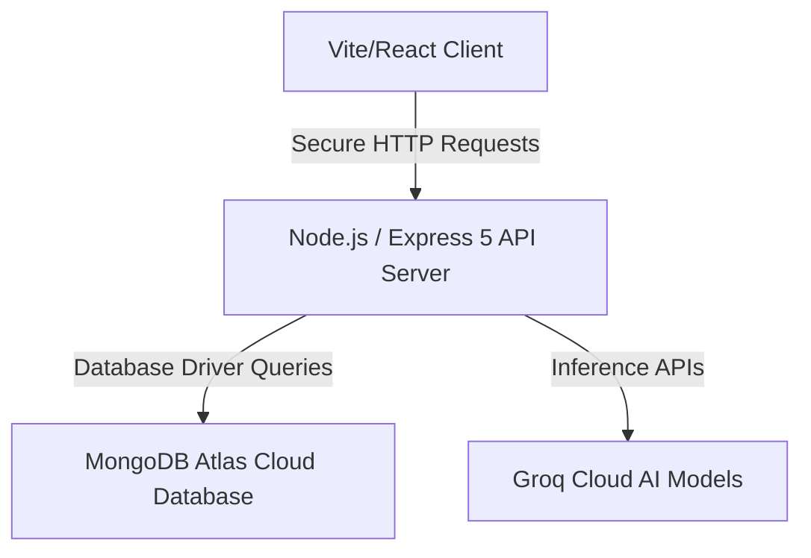

# PrepMatrix AI

PrepMatrix AI is a modern, premium, and feature-rich study planning and cognitive learning companion. It integrates state-of-the-art AI assistance, dynamic task rebalancing, hands-free voice operations, and deep study telemetry to help students organize academic tracks, assess progress, and unlock their highest potential.

Live Frontend: [https://prep-matrix-ai.vercel.app](https://prep-matrix-ai.vercel.app)  
Live Backend: [https://prepmatrix-ai.onrender.com](https://prepmatrix-ai.onrender.com)

---

## 📅 Features

*   📅 **Smart Planner & Scheduler:** Automatically distributes study workloads, balances daily tasks based on difficulty, and offers active recovery strategies for missed milestones.
*   🤖 **AI Study Assistant:** Interactive study chatbot tailored to your academic level. Clarifies doubts, outlines topics, and retrieves planner metrics directly in conversation.
*   📊 **Telemetry & Analytics:** Visualizes task completion progress, daily task distribution, exam readiness projections, and weekly study velocity signals.
*   🎙️ **Voice-Command Assistant:** Hands-free voice controls. Use "Hey Prep", "Prep Matrix", or "Hey PrepMatrix" to open pages, scroll, or ask study questions.
*   🏆 **Interactive Quizzes:** Generates custom topic-level quizzes powered by AI, keeping track of scores and difficulty progressions.
*   📝 **Interactive Study Notes:** Save chapter summaries, document custom doubts, and keep track of left-over topics per subject.
*   📚 **Curated Study Materials:** Suggests chapter-wise online reference articles, videos, and lets you bookmark your favorite resource links.
*   📄 **PDF Report Generation:** Generates detailed PDF intelligence reports highlighting task completion metrics, subject breakdowns, and productivity trends.

---

## 🛠️ Tech Stack

| Layer | Technology | Role / Description |
| :--- | :--- | :--- |
| **Frontend** | React (Vite), React Router, Lucide Icons, CSS3 | Single-page application utilizing glassmorphism aesthetics, fluid animations, and highly responsive viewports. |
| **Backend** | Node.js, Express 5 | Serves robust REST APIs, processes push notifications, and manages dynamic auth routes. |
| **Database** | MongoDB Atlas, MongoDB Node Driver | Schema-less high-performance cloud storage for study schedules, user profiles, notes, and quiz histories. |
| **AI Inference** | Groq Cloud, Llama 3.3 (70B), Web Speech API | Performs sub-second AI chat response generation, quiz crafting, and browser-based speech recognition. |

---

## 🏗️ Architecture

PrepMatrix AI is designed around a modern decoupled client-server architecture:

*   **Client Layer:** Built with React (Vite) as a Single Page Application (SPA). It maintains local states and triggers asynchronous requests to the backend API via a centralized and authorized HTTP client.
*   **Server Layer:** An Express API server that acts as a secure intermediary. It implements routing protocols, routes queries, handles scheduling computations, and orchestrates calls to external systems.
*   **Database & Storage:** MongoDB Atlas acts as the cloud document store. The native MongoDB Node driver is used to query collections securely.
*   **AI Integrations:** External APIs (Groq Cloud) are called server-side to hide credentials and deliver secure model generation.

---

## ✨ Key Highlights

*   **Dynamic Workload Rebalancing:** Intelligent algorithms distribute study workloads based on subject difficulty and automatically adapt to missed milestones to keep students on track.
*   **Premium Glassmorphism Design:** Curated dark themes, custom micro-interactions, responsive grids, and visual typography optimized for both desktop and mobile viewports.
*   **Low-Latency AI Operations:** Offers instant AI quiz generation and voice command interfaces powered by sub-second model response latency.
*   **Data Integrity & Backups:** Includes built-in mechanisms to export, import, and backup your entire study workspace data safely in JSON format.

---

## 📄 License

This project is licensed under the MIT License. Developed for Divyen R M.

