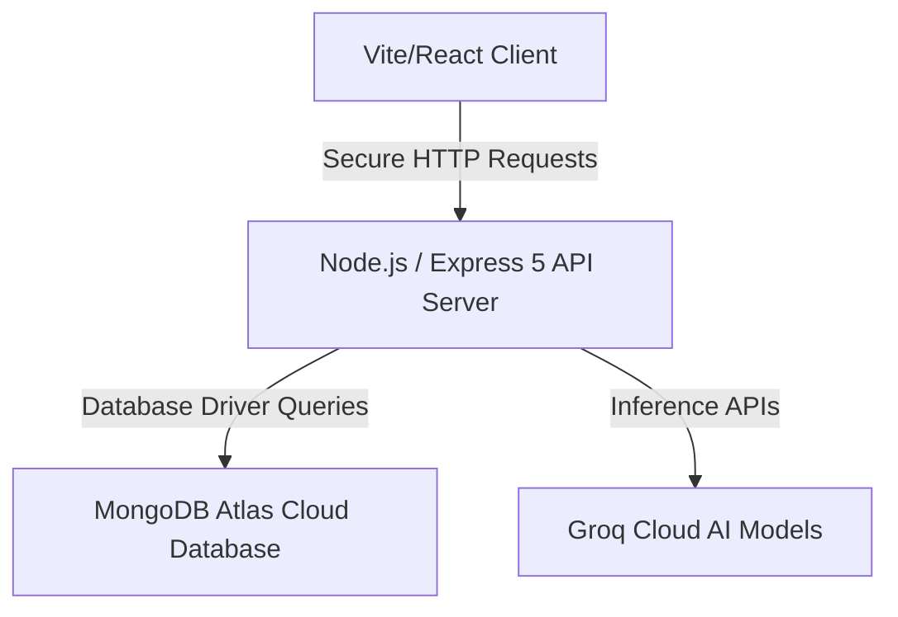

# PrepMatrix AI

PrepMatrix AI is a modern, premium, and feature-rich study planning and cognitive learning companion. It brings together exam-date-driven planning, dynamic task rebalancing, profile-aware AI assistance, hands-free browser voice controls, secure assessments, and deep study telemetry to help students organize academic tracks, assess progress, and prepare with confidence.

Live Frontend: [https://prep-matrix-ai.vercel.app](https://prep-matrix-ai.vercel.app)  
Live Backend: [https://prepmatrix-ai.onrender.com](https://prepmatrix-ai.onrender.com)

---

## 📅 Features

* **📅 Smart Planner & Scheduler:** Builds exam-date-driven study schedules, distributes chapters by subject difficulty, supports multiple planning strategies, rebalances active plans, and recovers missed-task backlogs.
* **🎓 Academic Profile & Subject Library:** Personalizes the workspace by class or degree, curriculum or board, academic track, department or specialization, subjects, chapter counts, and difficulty.
* **🎯 Goals, Reminders & To-Dos:** Manages dated goals, timed reminders, daily tasks, study targets, review targets, snoozing, and supported browser push notifications.
* **🤖 AI Study Assistant:** Provides learner- and planner-aware explanations, study guidance, topic breakdowns, and contextual answers through authenticated chat.
* **📎 Attachment-Aware AI Chat & History:** Accepts validated image and PDF context, extracts PDF text, and stores conversations that users can load, rename, clear, or delete.
* **📊 Telemetry & Analytics:** Visualizes completion, task distribution, subject progress, topic timelines, focus areas, weekly patterns, and completion-based readiness.
* **🏆 Gamification & Readiness:** Converts planner activity into XP, levels, badges, momentum feedback, streak indicators, readiness bands, and recovery guidance.
* **🎙️ Voice-Command Assistant:** Uses browser speech recognition and synthesis for navigation, scrolling, study questions, spoken replies, and voice-captured doubts.
* **🧠 Interactive Quizzes:** Generates learner-profile-aware 5- or 10-question topic quizzes with scoring, answer explanations, saved history, and PDF attempt export.
* **📝 Interactive Study Notes:** Captures searchable doubts and revision notes, tracks open or resolved status, and turns saved notes into planner tasks.
* **🔎 Contextual Study Materials:** Creates chapter-aware Google and YouTube search pathways for concepts, notes, practice, and revision, with bookmark support; links are contextual suggestions, not curated or independently verified resources.
* **🛡️ Secure Exam Workspace:** Unlocks at 80% planner completion and provides 40-MCQ, 60-minute exams with answer autosave, fullscreen and tab-visibility violation handling, delayed 72-hour results, and eligible achievement certificates.
* **📄 AI Question Papers & Offline Timer:** Generates saved, mark-allocated question papers and answer keys for PDF export, alongside a persistent browser-local focus and offline-paper timer.
* **🌳 Worktree Mind Maps:** Builds saved visual study trees with parent-child links, layout presets, fullscreen controls, editing, and PDF export.
* **🎨 Appearance & Data Controls:** Customizes backgrounds, brightness, accents, typography, card density, glass opacity, cursor, sounds, wake mode, and notifications, with JSON backup/import and destructive data controls.
* **📑 Reports & Exports:** Produces timetable, quiz-attempt, planner-report, question-paper, answer-key, exam-result, certificate, and mind-map PDFs, plus JSON workspace backup and restore.

---

## 🛠️ Tech Stack

| Layer | Technology | Role / Description |
| :--- | :--- | :--- |
| **Frontend** | React 19, Vite 8, React Router 7, Lucide React, Recharts, CSS | Responsive single-page application with glassmorphism styling, routed workspaces, analytics, and browser integrations. |
| **Backend** | Node.js, Express 5 | Provides authenticated REST APIs, study-workspace synchronization, notification delivery, attachment processing, and exam orchestration. |
| **Database** | MongoDB Atlas, MongoDB Node.js Driver | Stores users, sessions, workspaces, notes, quizzes, chats, mind maps, exams, results, and generated papers. |
| **AI Inference** | Groq Cloud, configurable chat and vision models, Web Speech API | Powers server-side AI study features and browser-native speech recognition and synthesis without fixing the application to one model. |

---

## 🏗️ Architecture

PrepMatrix AI is designed around a modern decoupled client-server architecture:

* **Client Layer:** Built with React and Vite as a single-page application. It manages interactive study workflows and communicates through a centralized credential-aware API client.
* **Server Layer:** An Express API server handles authentication, workspace persistence, scheduling operations, notifications, attachments, AI requests, and secure assessment rules.
* **Database & Storage:** MongoDB Atlas is the document store for user-scoped academic, planning, chat, quiz, mind-map, exam, and paper data.
* **AI Integrations:** Groq Cloud requests are made server-side with environment-configured chat and vision models, while browser speech features use the Web Speech API.

---

## ✨ Key Highlights

* **Dynamic Workload Rebalancing:** Redistributes study work when plans change and recovers missed tasks while preserving an undo path.
* **Premium Glassmorphism Design:** Delivers responsive workspaces, rich appearance controls, fluid interactions, and focused desktop and mobile layouts.
* **Integrated AI Operations:** Connects profile-aware chat, image and PDF context, quiz generation, exams, question papers, and browser voice features through configurable services.
* **Data Integrity & Backups:** Persists user-scoped study data and provides JSON export, import, workspace reset, and password-confirmed account deletion controls.

---

## 📄 License

This project is licensed under the MIT License. Developed for Divyen R M.
