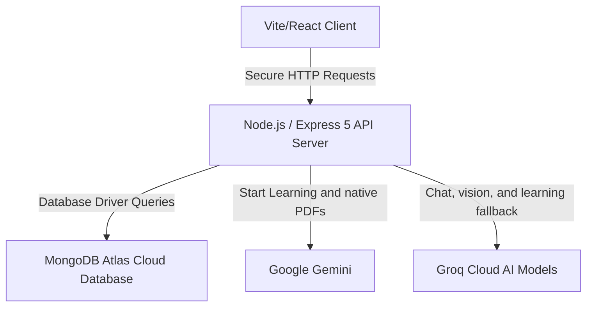

# PrepMatrix AI

PrepMatrix AI is a modern, premium, and feature-rich study planning and cognitive learning companion. It brings together exam-date-driven planning, dynamic task rebalancing, profile-aware AI assistance, hands-free browser voice controls, secure assessments, and deep study telemetry to help students organize academic tracks, assess progress, and prepare with confidence.

Live Frontend: [https://prep-matrix-ai.vercel.app](https://prep-matrix-ai.vercel.app)  
Live Backend: [https://prepmatrix-ai.onrender.com](https://prepmatrix-ai.onrender.com)

---

## 📅 Features

* **📅 Smart Planner & Scheduler:** Builds exam-date-driven study schedules, distributes chapters by subject difficulty, supports multiple planning strategies, rebalances active plans, and recovers missed-task backlogs.
* **🎓 Academic Profile & Subject Library:** Personalizes the workspace by class or degree, curriculum or board, academic track, department or specialization, subjects, chapter counts, and difficulty.
* **🎯 Goals, Reminders & To-Dos:** Manages dated goals, timed reminders, daily tasks, study targets, review targets, snoozing, and supported browser push notifications.
* **🤖 AI Study Assistant:** Provides learner- and planner-aware explanations, study guidance, topic breakdowns, and contextual answers through authenticated chat.
* **📎 Attachment-Aware AI Chat & History:** Accepts validated image and PDF context, extracts PDF text, and stores conversations that users can load, rename, clear, or delete.
* **Start Learning Notebooks:** Uses Gemini 3.5 Flash-Lite to understand PDFs natively and build revision notes, questions, and concept maps, with a Groq fallback and a one-time, account-scoped privacy disclosure before material is sent.
* **CodeMatrix:** A compiler workspace in Start Learning for coding subjects and relevant academic profiles, with separate language drafts, program input, output, error locations, Python traces, SQL tables, and web previews. Optional account setup links to Subjects, notebook preparation, and Planner.
* **📊 Telemetry & Analytics:** Visualizes completion, task distribution, subject progress, topic timelines, focus areas, weekly patterns, and completion-based readiness.
* **🏆 Gamification & Readiness:** Converts planner activity into XP, levels, badges, momentum feedback, streak indicators, readiness bands, and recovery guidance.
* **🎙️ Voice-Command Assistant:** Uses browser speech recognition and synthesis for navigation, scrolling, study questions, spoken replies, and voice-captured doubts.
* **🧠 Interactive Quizzes:** Generates learner-profile-aware 5- or 10-question topic quizzes with scoring, answer explanations, saved history, and PDF attempt export.
* **📝 Interactive Study Notes:** Captures searchable doubts and revision notes, tracks open or resolved status, and turns saved notes into planner tasks.
* **🔎 Contextual Study Materials:** Creates chapter-aware Google and YouTube search pathways for concepts, notes, practice, and revision, with bookmark support; links are contextual suggestions, not curated or independently verified resources.
* **🛡️ Secure Exam Workspace:** Unlocks at 80% planner completion and provides 40-MCQ, 60-minute exams with answer autosave, fullscreen and tab-visibility violation handling, delayed 72-hour results, and eligible achievement certificates.
* **📄 AI Question Papers & Offline Timer:** Generates saved, mark-allocated question papers and answer keys for PDF export, alongside a persistent browser-local focus and offline-paper timer.
* **🌳 Worktree Mind Maps:** Builds saved visual study trees with parent-child links, layout presets, fullscreen controls, editing, and PDF export.
* **🎨 Appearance & Data Controls:** Customizes backgrounds, brightness, accents, typography, card density, glass opacity, cursor, sounds, wake mode, and notifications, with JSON backup/import and destructive data controls.
* **📑 Reports & Exports:** Produces timetable, quiz-attempt, planner-report, question-paper, answer-key, exam-result, certificate, and mind-map PDFs, plus JSON workspace backup and restore.

---

## 🛠️ Tech Stack

| Layer | Technology | Role / Description |
| :--- | :--- | :--- |
| **Frontend** | React 19, Vite 8, React Router 7, Lucide React, Recharts, CSS | Responsive single-page application with glassmorphism styling, routed workspaces, analytics, and browser integrations. |
| **Backend** | Node.js, Express 5 | Provides authenticated REST APIs, study-workspace synchronization, notification delivery, attachment processing, and exam orchestration. |
| **Database** | MongoDB Atlas, MongoDB Node.js Driver | Stores users, sessions, workspaces, notes, quizzes, chats, mind maps, exams, results, and generated papers. |
| **AI Inference** | Google Gemini, Groq Cloud, configurable models, Web Speech API | Uses Gemini 3.5 Flash-Lite as the Start Learning primary with native PDF understanding, Groq for fallback and other AI features, and browser-native speech recognition and synthesis. |

---

## 🏗️ Architecture

PrepMatrix AI is designed around a modern decoupled client-server architecture:


```mermaid
graph TD
    A[Vite/React Client] -->|Secure HTTP Requests| B[Node.js / Express 5 API Server]
    B -->|Database Driver Queries| C[MongoDB Atlas Cloud Database]
    B -->|Start Learning and native PDFs| D[Google Gemini]
    B -->|Chat, vision, and learning fallback| E[Groq Cloud AI Models]
```

* **Client Layer:** Built with React and Vite as a single-page application. It manages interactive study workflows and communicates through a centralized credential-aware API client.
* **Server Layer:** An Express API server handles authentication, workspace persistence, scheduling operations, notifications, attachments, AI requests, and secure assessment rules.
* **Database & Storage:** MongoDB Atlas is the document store for user-scoped academic, planning, chat, quiz, mind-map, exam, and paper data.
* **AI Integrations:** Start Learning sends consented study material to an environment-configured Gemini model first, including native inline PDFs, and lazily prepares the existing Groq text/OCR fallback only if needed. Other Groq requests and browser Web Speech features are unchanged.

---

## ✨ Key Highlights

* **Dynamic Workload Rebalancing:** Redistributes study work when plans change and recovers missed tasks while preserving an undo path.
* **Premium Glassmorphism Design:** Delivers responsive workspaces, rich appearance controls, fluid interactions, and focused desktop and mobile layouts.
* **Integrated AI Operations:** Connects profile-aware chat, privacy-gated native PDF learning notebooks, quiz generation, exams, question papers, and browser voice features through configurable services.
* **Data Integrity & Backups:** Persists user-scoped study data and provides JSON export, import, workspace reset, and password-confirmed account deletion controls.


## CodeMatrix configuration

Open **Start Learning → CodeMatrix** (`/learn/code-matrix`). Computing degrees, departments, streams, and subjects determine eligibility; a board or a broad Science/Engineering label alone does not. Middle school and later learners can qualify through a coding subject. Early years and primary profiles are excluded.

The workspace offers writing, running, and debugging without a lessons submodule. On first entry, it suggests **Add subject**, **Start learning** (notebook preparation), and **Create plan**, in that order. Completed steps disappear, the next missing step is recommended, and **Continue to compiler** dismisses setup. Drafts and setup progress belong to the active academic profile and sync to MongoDB, with a browser checkpoint for interrupted saves.

| Language | Execution and debugging |
| --- | --- |
| Python | Pyodide 0.27.7, with live terminal input, exceptions and up to 200 recorded line/variable steps. Variables are captured before each line. |
| JavaScript | QuickJS 0.32.0 adapter with console output, runtime errors, synchronous `readLine()` / `prompt()` input, and awaited code/timers. |
| SQL | sql.js 1.13.0 (SQLite dialect). Each run gets a fresh `students(id, name, age, grade, marks)` practice database; results are bounded tables. |
| HTML / CSS / JavaScript | Combined isolated webpage preview. Put JavaScript in the `script.js` tab; inline scripts in HTML and external resources are blocked. Common loops and recursion have cooperative execution guards. |
| C / C++ | Bundled WebAssembly Clang, C11 / C++17, standard console input/output and compiler errors. C++ includes the standard library. |
| Java | Bundled Doppio JVM 0.5.0 and OpenJDK 8 class library/compiler. Use Java 8 syntax and a `Main` class in `Main.java`; `Scanner` and buffered console input are supported. |

Select **Run code**, then type directly beside the program's prompt in the output terminal and press **Enter**. Blank lines are allowed. **End input** (or Ctrl+D) sends EOF; **Stop** terminates the isolated worker. There is no separate input box to fill before running. Output/Debug/Preview and the web file tabs use compact rounded controls.

**No compiler API key, paid subscription, Docker, local compiler installation, or new `.env` values are needed.** Use an updated Chrome or Edge browser: C/C++ and interactive Python require WebAssembly JSPI. Unsupported browsers display an explanation when running. C/C++ downloads roughly 60 MB and Java roughly 40 MB on first use; allow the first compilation to finish. These assets are served by the frontend and normal hosting/bandwidth costs still apply. Python and SQLite load pinned runtime files from jsDelivr. Offline execution is not guaranteed.

For local development:

```sh
npm ci
npm run dev
```

Run the existing application backend as usual for login and draft synchronization. Student programs execute in a fresh browser worker inside an opaque-origin iframe; they do not run as processes on the app server. Programs get no access to account storage or arbitrary network resources. The compiler supports console exercises and standard libraries, with no external packages, operating-system integration, Java GUI, or multi-file project tooling. C/C++ file-system operations beyond stdin/stdout are unsupported. Java's temporary files disappear after every run.

Runtime loading/compilation has a two-minute deadline. Execution has a cumulative 10-second deadline, excluding time waiting for terminal input (up to five minutes per prompt). Input and output are bounded. Debug shows compiler/runtime errors and source locations; Python additionally supports stepping through a recorded trace. Full live breakpoint debugging is not provided.

`npm run build` verifies the bundled runtime checksums before building. To restore or rebuild compiler assets, run `npm run codematrix:assets` (requires internet, `tar`, and installed npm dependencies). Sources and hashes are pinned in `scripts/code-matrix/sources.json`; bundled assets and license notices live under `public/code-matrix/runtime`. Include this directory when publishing the frontend. Vite, Vite preview, Express, and Vercel configurations allow the isolated runtime to fetch these public files with CORS; other hosts need `Access-Control-Allow-Origin: *` on this directory and must serve its files before the SPA fallback.

The existing authenticated Judge0 API endpoints remain available for older clients, but the CodeMatrix page does not call them. `JUDGE0_CE_*` variables are optional and can stay blank for this browser compiler.

Run focused regression checks with `node --test src/utils/codeMatrix*.test.js server/codeMatrix*.test.js`. Coverage includes profile eligibility, setup progress, drafts, authentication/scope boundaries, compiler adapter failures, cancellation, output limits, and preview guards.

For real browser runtime checks, start Vite and open `/scripts/code-matrix/browser-smoke.html`, then select **Run smoke tests**. The page checks C/C++ standard input, Java Scanner/EOF, JavaScript input after `await`, Python blank input/EOF, SQLite tables, error line numbers, cancellation, and the execution deadline. Append `?language=javascript` to check one language. This development fixture is not included in the application build.

## 📄 License

This project is licensed under the MIT License. Developed for Divyen R M.
